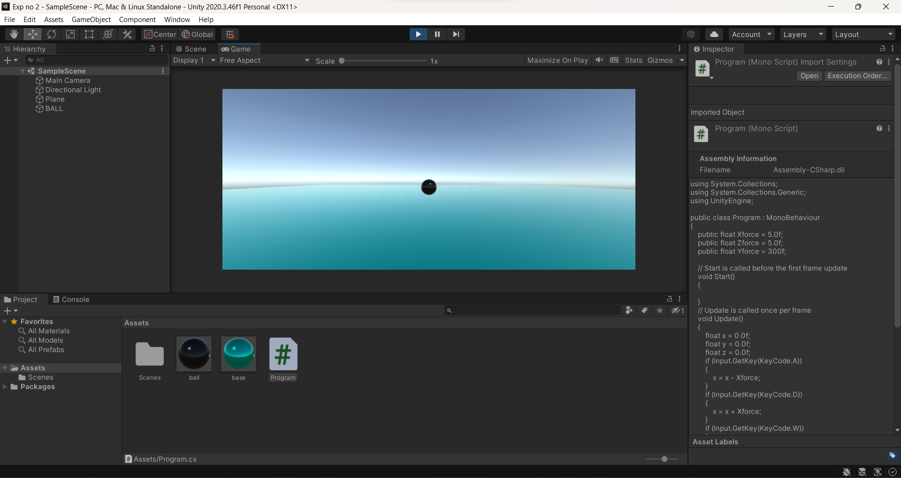
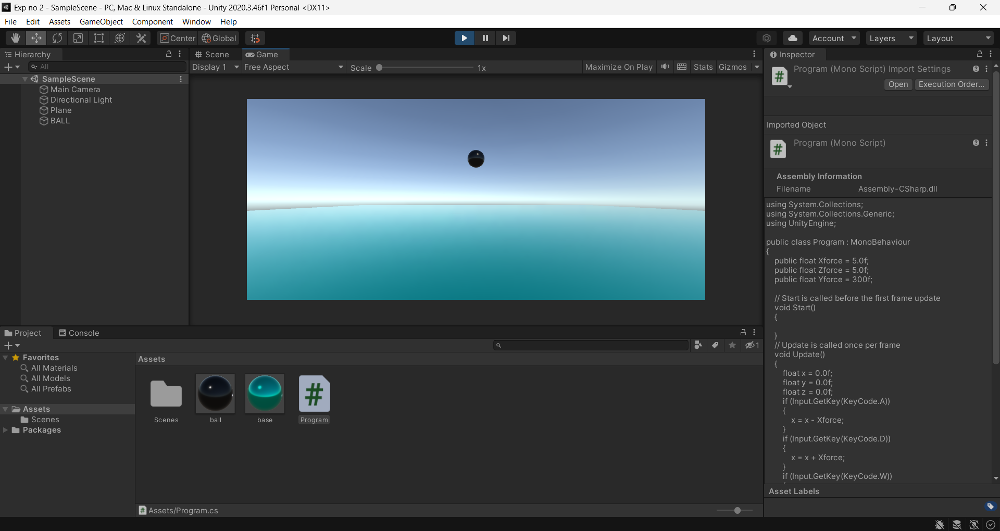

# ROLL-A-BALL

## AIM:
To Roll a Ball using C# program in unity .
## ALGORITHM:

### Step1: 
File -> Scene -> Select the scene -> Save as-> New folder(Scenes)-> File name (MiniGame)

### Step2: 
Heirarchy -> 3D Object-> Plane 
[ Right side-> Inspector-> Change the name of plane (Name: Ground)
Transform -> Reset
Edit -> FrameSelected ]

### Step3:
Scale the ground by giving the scaling value as x=4 y=1 z=4

### Step4:
Heirarchy -> 3D Object-> Sphere

[ Right side-> Inspector-> Change the name of plane (Name: Player)
Transform -> Reset
Edit -> FrameSelected 
Transform -> Position -> y=0.5]

### Step5:
Hierarchy -> DirectionalLight

[ Inspector -> Change the color to white (255,255,255)]

### Step6:
 Create a folder in project and name as Materials

[Material folder -> Create -> Material (Name: Background)
Inspector ->Surface Inputs ->BaseMAp (Choose the color)
Metallic map-> 0
Smoothness -> 0.25
Drag the Background to the plane and release the mouse]

Material folder -> Create -> Material (Name: Sphere)
Inspector ->Surface Inputs ->BaseMAp (Choose the color)
Metallic map-> 0
Smoothness -> 0.75
Drag the Sphere material to the ball and release the mouse

### Step7:
 Hierarchy -> Player-> Inspector ->Add component-> Rigidbody

### Step8:
Create a new script -> Create a folder in project (Name: Scripts)

Hierarchy -> Player -> Inspector-> AddComponent-> NewScripts-> PlayerController( Click create and Add)
Copy the PlayerController and drag to Script folder
Double click the PlayerController file and type the coding

## PROGRAM:
```
using System.Collections;
using System.Collections.Generic;
using UnityEngine;

public class Program : MonoBehaviour
{
    public float Xforce = 5.0f;
    public float Zforce = 5.0f;
    public float Yforce = 300f;

    // Start is called before the first frame update
    void Start()
    {

    }
    // Update is called once per frame
    void Update()
    {
        float x = 0.0f;
        float y = 0.0f;
        float z = 0.0f;
        if (Input.GetKey(KeyCode.A))
        {
            x = x - Xforce;
        }
        if (Input.GetKey(KeyCode.D))
        {
            x = x + Xforce;
        }
        if (Input.GetKey(KeyCode.W))
        {
            z = z + Zforce;
        }
        if (Input.GetKey(KeyCode.S))
        {
            z = z - Zforce;
        }
        if (Input.GetKeyDown(KeyCode.Space))
        {
            y = Yforce;
        }
        GetComponent<Rigidbody>().AddForce(x, y, z);

    }
}
```
## OUTPUT:




## RESULT:
Thus, The 3D application for Roll the Ball in unity is developed successfully.